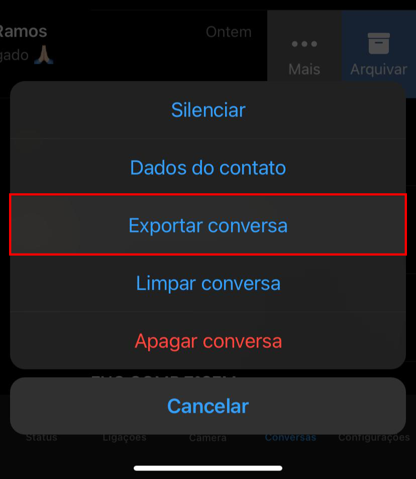
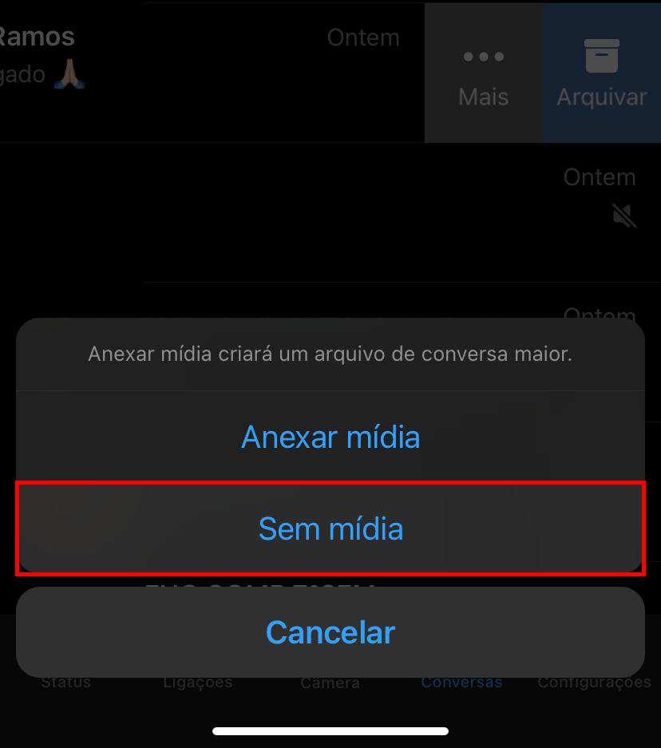
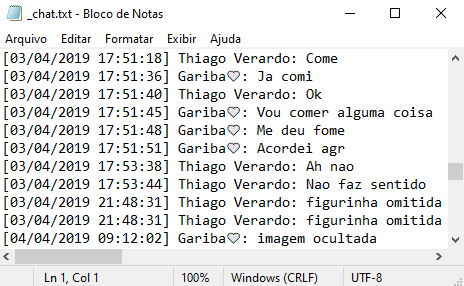
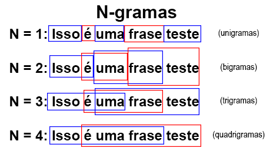
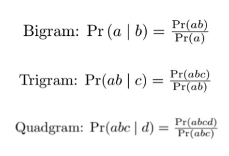
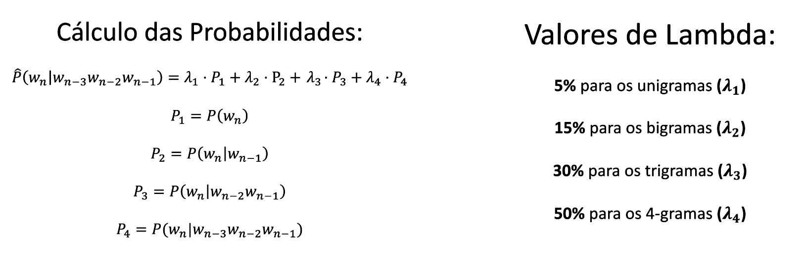
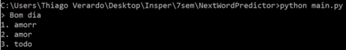

# Preditor de próxima palavra

**Projeto final de Processamento de Linguagem Natural**

Pedro Ramos e Thiago Verardo

## Abstract

A predição de próxima palavra é uma tecnologia que simplifica o processo de digitação ao sugerir próximas palavras para que o usuário selecione e, assim, economize tempo. Esse artigo oferece uma ideia de implementação de um modelo de linguagem baseado em *n-grams* e utiliza chats do Whatsapp para compor o corpus utilizado como base para o preditor. A implementação foi feita em Python e buscava replicar os resultados obtidos no teclado do *smartphone* do usuário.

**Palavras-chave:** Modelo de linguagem, Corpus, N-grams.

## Introdução

Esse projeto tem como objetivo o desenvolvimento de um preditor de próxima palavra, que analisa uma frase e retorna três opções para o usuário. 

Não se trata de uma ideia inovadora, uma vez que ao digitar uma busca no Google, a propria barra de buscas oferece algumas sugestões de *autocomplete*, mas ainda assim é interessante de ser estudada. Outro exemplo é o teclado dos *smartphones* que conforme o usuário digita, o teclado já vai dando sempre 3 sugestões de próxima palavra. Essas interações são extremamente interessantes e úteis, permitindo que usuário aumente sua produtividade ao fazer buscas no Google ou escrever no seu *smartphone*. 

Existem algumas formas de conduzir um projeto desse tipo. Uma abordagem muito interessante é a utilização de redes neurais recorrentes para realizar a tarefa. Priya Dwivedi, em seu artigo ["Building a Next Word Predictor in Tensorflow"](https://towardsdatascience.com/building-a-next-word-predictor-in-tensorflow-e7e681d4f03f), discorre sobre a implementação de um preditor de próxima palavra utilizando essa abordagem das RNNs. Entretanto, a abordagem utilizada para esse projeto foi outra. O modelo utilizado é conhecido como *N-Gram Model*. Esse modelo é capaz de utilizar as $N$ últimas palavras digitadas pelo usuário para calcular as probabilidades de todas as possibilidades de próxima palavra. Finalmente, com as probabilidades calculadas, são selecionadas as três possibilidades com mais alta probabilidade para serem devolvidas para o usuário. O artigo ["Next word  prediction based  on the N-gram  model for Kurdish Sorani and Kurmanji"](https://www.researchgate.net/publication/343441648_Next_word_prediction_based_on_the_N-gram_model_for_Kurdish_Sorani_and_Kurmanji/fulltext/5f2a2625a6fdcccc43abe3ce/Next-word-prediction-based-on-the-N-gram-model-for-Kurdish-Sorani-and-Kurmanji.pdf) explica a fundo a implementação de um modelo desse tipo no contexto da língua curda.

O objetivo do projeto é desenvolver uma ferramenta única para cada pessoa, completamente personalizada, para que as previsões sejam as mais adequadas para o usuário da ferramenta.

## Desenvolvimento

### Definição da base de dados:

Primeiramente, para estruturar o projeto é necessária a escolha de uma base de dados. Essa, que será utilizada como base da estrutura de frases para a análise. Como o objetivo é criar um preditor específico para cada pessoa, a base de dados escolhida foi a da conversa do WhatsApp de cada usuário. O WhatsApp é o aplicativo de conversas mais utilizado no Brasil e ele permite que baixe sua conversa em arquivos ".txt".

  
  
  

  <c style="font-size:11px">Imagens 1, 2 e 3: Tutorial de como exportar uma conversa do WhatsApp</c>

###  Limpeza dos dados:

Com o arquivo em mãos, inicia-se o processo de desenvolvimento do projeto, de fato. Primeiramente, para que a análise seja feita de maneira correta, é necessária uma limpeza nos dados. Como é possível ver abaixo, o arquivo gerado pelo Whatsapp possui muitas informações irrelevantes para o modelo, como data, horário e usuário que enviou a mensagem. Assim é necessário realizar uma limpeza desse arquivo para preservar somente os textos produzidos pelo usuário desejado. Afinal, o objetivo é produzir um preditor personalizado para esse usuário. 

    
  <c style="font-size:11px">Imagem 4: Estrutura do arquivo gerado pelo WhatsApp</c>  

Além disso, como o usuário deve baixar as conversas sem as mídias, existem frases nos locais delas que não interessam para o modelo e que, portanto, também devem ser ignoradas pelo programa.

### Estrutura dos dados:

A estrutura de dados utilizada nesse projeto foi um dicionário. Ele é ideal para esse tipo de aplicação, pois possui complexidade de busca $O(1)$ e, assim permite alta velocidade da aplicação. Esse dicionário é dividido em unigramas, bigramas, trigramas e quadrigramas, e dentro de cada uma dessas chaves existem os conjutos de palavras que formam o respectivo n-grama, e suas respectivas frequências e probabilidades de serem selecionadas.

Para entender essa estrutura, primeiramente deve-se entender o conceito por trás dos N-gramas.

    
  <c style="font-size:11px">Imagem 5: N-gramas</c>  

Todas as frases são separadas e divididas em uni, bi, tri e quadrigramas se possível. Caso a frase tenha menos palavras que o N-grama precisa para ser construído, esse n-grama simplesmente é ignorado. Com esse conceito em mãos, cada uma das mensagens de texto enviadas pelo usuário é processada e o dicionário é preenchido com as respectivas frequências de cada n-grama. 

Uma vez que as frases estão estruturadas em N-gramas, as probabilidades deles são calculadas. Para um unigrama esse cálculo é simples e basta dividir a frequência do unigrama pelo número total de palavras. Por outro lado, calcular a probabilidade de um N-grama não é tão intuitivo. Nesse caso, o cáculo é feito seguindo a lógica abaixo:

    
  <c style="font-size:11px">Imagem 6: Cálculo individual das probabilidades dos N-gramas</c>  

Com a base de dados em mãos o usuário pode digitar algum texto e o modelo calcula a probabilidade das possibilidades de próxima palavra utilizando interpolação e back-off. Isso é muito importante, pois suponha que fossem utilizados somente os 4-gramas para a previsão, caso uma sequência de 3 palavras não fosse encontrada na base de dados a probabilidade seria 0% para todos os casos e assim o modelo seria inútil. No nosso caso, utilizamos back-off para que quando um modelo de maior ordem falha (probabilidade 0% para tudo) utilizamos modelos de menor ordem para compensar. Além disso, utilizamos também a interpolação e assim podemos levar em consideração os modelos de unigramas, bigramas, trigramas e 4-gramas ao mesmo tempo, mas com pesos lambda diferentes.

    
  <c style="font-size:11px">Imagem 7: Cálculo das probabilidades utilizando backoff e interpolação</c>  

### Preditor:

Para testar o preditor, foram utilizadas as conversas de Thiago Verardo com sua namorada e seu melhor amigo. Essas duas conversas já foram capazes de compor um corpus grande o suficiente para a utilização do modelo. Os resultados obtidos foram bem próximo do que é apresentado para ele no teclado de seu *smartphone* como é possível observar no exemplo abaixo:

    
  <c style="font-size:11px">Imagem 8: Sugestões do WhatsApp</c>  
   
  <c style="font-size:11px">Imagem 9: Sugestões do preditor</c>  

Em ambos os casos, pode-se ver que a palavra "amorr" e "amor" são sugeridas e o único *outlier* foi a sugestão de "todo"ao invés dos emojis. Entretanto, os emojis foram filtrados nem estão sendo levados em consideração pelo modelo. Se fossem levados em conta é provável que um emoji fosse a outra sugestão ao invés da palavra "todo".

### Conclusão e trabalhos futuros:

Assim, é possível concluir que o modelo de n-gramas é bem simples, mas é poderoso para esse tipo de aplicação. Além disso, ele é bem rápido e leve o que o torna adequado para aplicações *mobile* como o teclado do *smartphone*. Por outro lado, esse modelo possui uma limitação. Quando um usuário tenta gerar frases completas a partir do sugestor, a técnica não funciona bem e acaba gerando textos sem sentido com frequência. Ou seja, para gerar frases completas com sentido é ncessário a implementação de um modelo mais robusto.

Em futuras iterações espera-se ser possível melhorar ainda mais o desempenho do modelo através dos seguintes ajustes:

- Testar um modelo de redes neurais

- Adicionar emojis para a base de dados

- Utilizar um corpus ainda maior